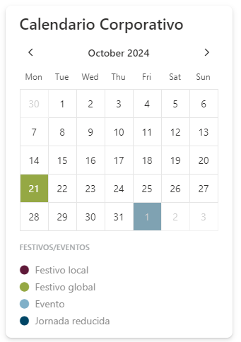

# spfx-popup

## Summary

Webpart whose functionality is to display a pop-up window with the following properties
- Title
- Subtitle
- Content
- Link
- Image



## Applies to

- [SharePoint Framework](https://aka.ms/spfx)
- [Microsoft 365 tenant](https://docs.microsoft.com/en-us/sharepoint/dev/spfx/set-up-your-developer-tenant)

> Get your own free development tenant by subscribing to [Microsoft 365 developer program](http://aka.ms/o365devprogram)

## Prerequisites
- Node.js v18.20.4

## Instalación y Despliegue

### Debug
> First time:

```bash
npm install gulp --save-dev
gulp trust-dev-cert
```

Debug:

```bash
npm run debug # Debug en inglés
npm run debug-es # Debug en español
```
Browser:

> ?debug=true&noredir=true&debugManifestsFile=https://localhost:4321/temp/manifests.js

### Build

```bash
npm run clean
npm run build
npm run packageSolution
```

### NOTES:
> This web part uses Luxon library so the month and days will be translated to your local time.
