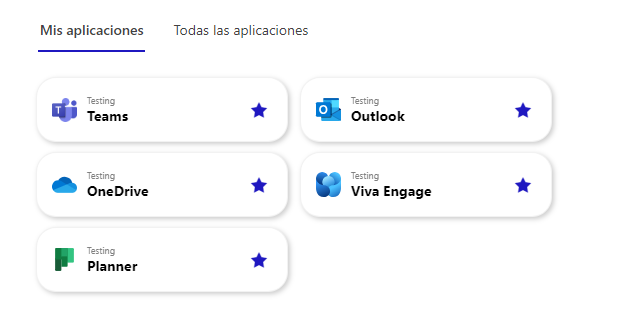

# Employee Hub

## Summary

SPFx application that allows managing each employee's favorite applications.



## Features

The "My Apps Feature" performs the creation of necessary lists for the application to function.

- The "MyAppsLinks" list is the list that contains the data of the available links.
- The "MyAppsFavorites" list is the list that contains the data of each employee's favorite applications.

## Webpart Config

This webpart allows the user to configure the main color of the application. If it is not configured, the default color will be used.

## Requirements

Required node version: >=16.13.0 <17.0.0

Developed in version: 16.18.1

## Deployment

```bash
npm run deploy
```

## Debug

```bash
npm run debug
```
